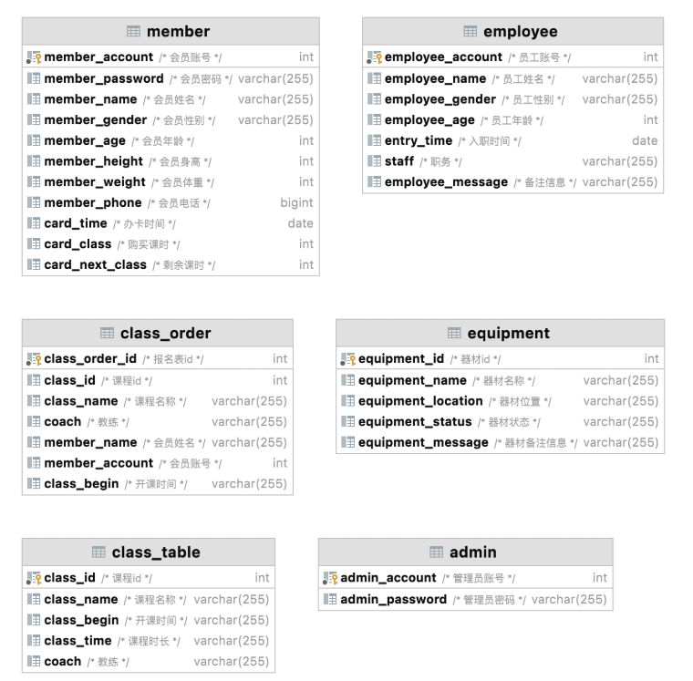
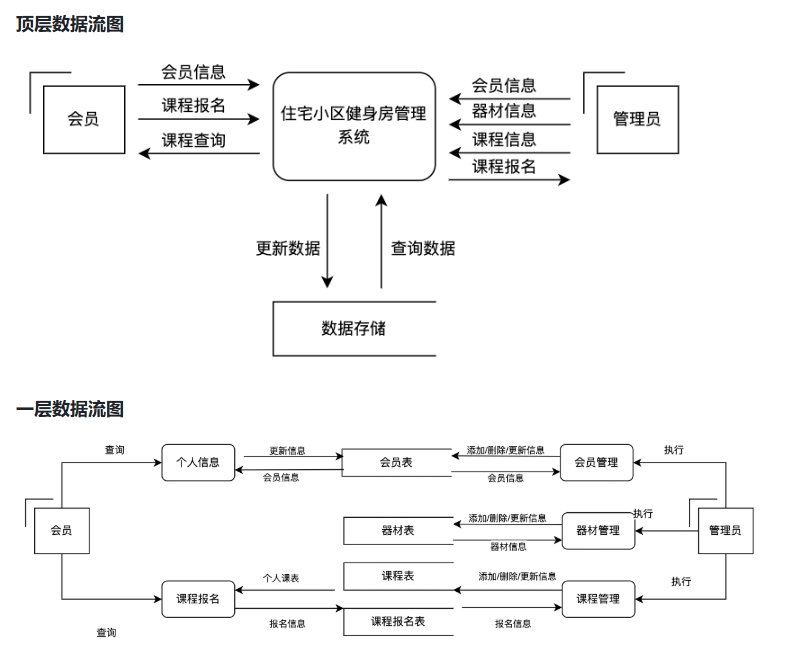
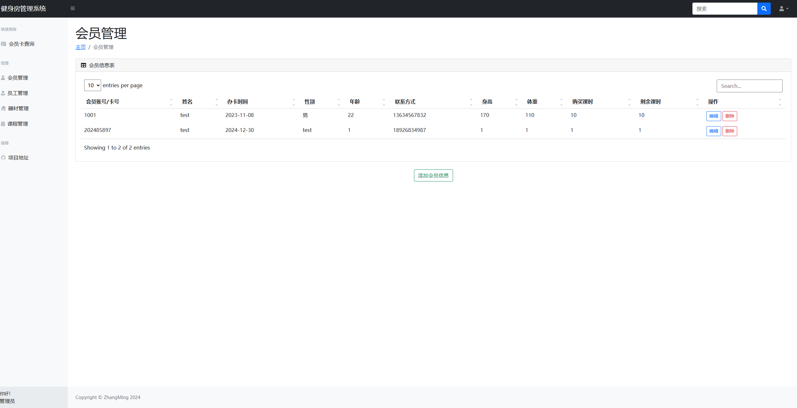
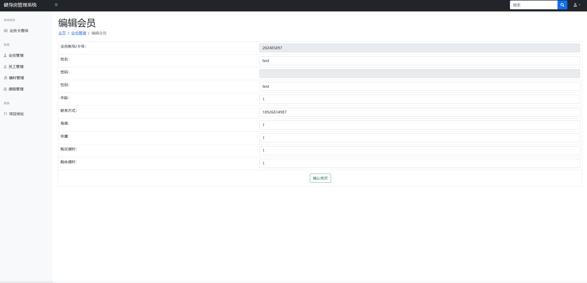

# gym
## 健身房管理系统设计需求介绍
### 一、系统概述
健身房管理系统旨在帮助健身房高效管理会员信息、课程安排、设备使用各类日常运营事务。通过集中的信息管理，提升健身房的服务质量和运营效率，增强用户体验。

### 二、功能需求
#### 会员管理

会员注册、信息更新与删除
#### 课程管理

课程安排（时间、地点、教练等信息）
#### 设备管理

健身器械状态管理（可预约、维修、报废等）

### 三、技术需求
平台支持：Windows11
数据库：opengauss
前端技术：html
后端技术：Java

### 四、用户界面需求
简洁易用：界面清晰、操作简单，适合不同用户（管理员、会员）的使用。

## 应用系统的设计

## 系统的实现

## 组员之间的分工
陈灿林 ： 数据库的设计以及后端的设计
杨欣霈 ： 前端设计与网页搭建